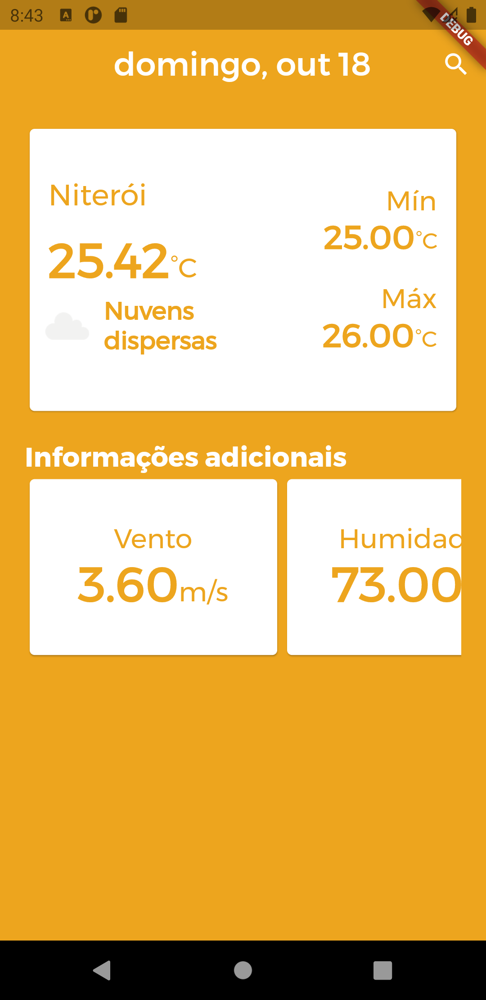
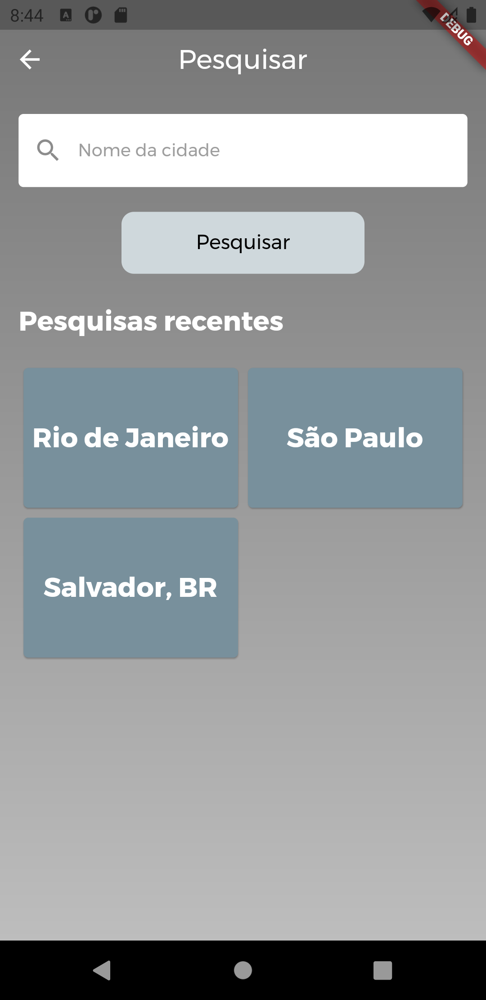
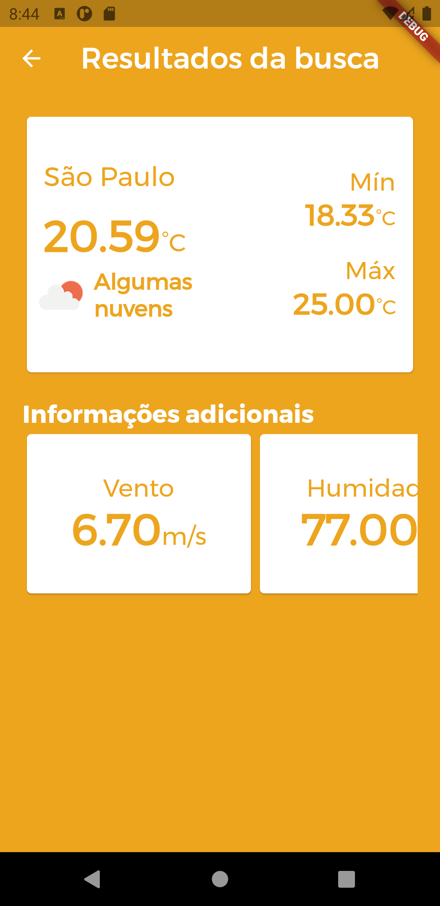

# Weather App

This is a application for weather information using the OpenWeather API. It can get weather information both from user's location and from a city search.

 &nbsp;
 &nbsp;

## Packages used

This is the list of packages used in this project. For more information, just click on them.

- [google_fonts](https://pub.dev/packages/google_fonts): ^1.1.0
- [intl](https://pub.dev/packages/intl): ^0.16.1
- [cached_network_image](https://pub.dev/packages/cached_network_image): ^2.3.2+1
- [geolocator](https://pub.dev/packages/geolocator): ^6.0.0+4
- [shared_preferences](https://pub.dev/packages/shared_preferences): ^0.5.12
- [get](https://pub.dev/packages/get): ^3.13.2
- [dio](https://pub.dev/packages/dio): ^3.0.10

## Getting Started

To run this application, first be sure that Flutter is properly installed and configured. Then:

- Clone this project
- Run the command `flutter pub get` in the project's root directory
- Start the application using your favorite IDE

**Usually the "play" option runs the application in _debug_ mode, which does not reflect the real performance. To run the application in similar way, use the command `flutter run --profile` using a physical device.**
